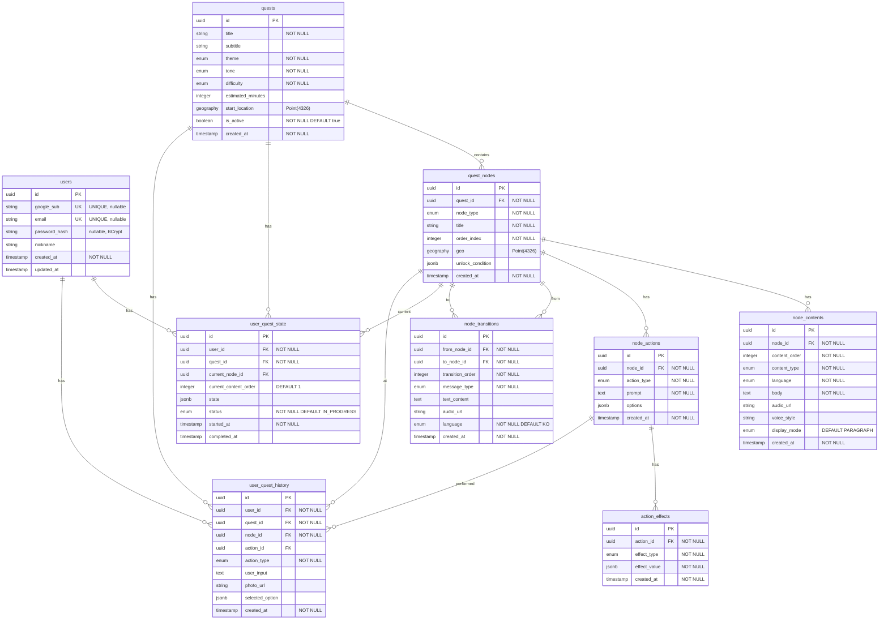

# Quest of Seoul Database ERD

## Entity Relationship Diagram

## 테이블 상세 설명

### 1. users (사용자)
- **설명**: JWT 로그인(이메일/비밀번호) 또는 Google OAuth2 로그인 사용자 정보
- **주요 필드**:
  - `google_sub`: Google 사용자 고유 식별자 (UNIQUE, nullable — OAuth 전용일 때만 설정)
  - `email`: 이메일 (UNIQUE, nullable — JWT 로그인·회원가입 시 필수)
  - `password_hash`: BCrypt 해시 (nullable — JWT 로그인/회원가입 사용자만 설정)
  - `nickname`: 표시 이름 (선택)
  - `created_at`, `updated_at`: 생성/수정 시각

### 2. quests (퀘스트)
- **설명**: 퀘스트 메타데이터
- **주요 필드**:
  - `theme`: 퀘스트 테마 (HISTORY, FOOD, FUN, PERSON, ARCHITECTURE, SENSORY)
  - `tone`: 퀘스트 톤 (SERIOUS, FRIENDLY, PLAYFUL, EMOTIONAL)
  - `difficulty`: 난이도 (EASY, NORMAL, DEEP)
  - `start_location`: 시작 위치 (PostGIS Point, 선택)
  - `is_active`: 활성화 여부

### 3. quest_nodes (퀘스트 노드)
- **설명**: 퀘스트의 각 장면/노드
- **주요 필드**:
  - `node_type`: 노드 타입 (LOCATION, WALK, VIEW, EAT, LISTEN, REFLECTION)
  - `order_index`: 노드 순서
  - `geo`: 노드 위치 (PostGIS Point, 선택적)
  - `unlock_condition`: 노드 언락 조건 (JSONB)

### 4. node_contents (노드 콘텐츠)
- **설명**: 노드의 순차적 콘텐츠 (텍스트 + 오디오)
- **주요 필드**:
  - `content_order`: 콘텐츠 순서
  - `content_type`: 콘텐츠 타입 (TEXT, AUDIO, AI_PROMPT)
  - `language`: 언어 (KO, EN, JP, CN)
  - `body`: 텍스트 내용
  - `audio_url`: 오디오 URL
  - `display_mode`: 표시 모드 (PARAGRAPH, SUBTITLE, QUOTE)

### 5. node_actions (노드 액션)
- **설명**: 노드에서 사용 가능한 사용자 액션
- **주요 필드**:
  - `action_type`: 액션 타입 (CHOICE, PHOTO, TEXT_INPUT, TIMER, EAT_CONFIRM)
  - `prompt`: 액션 프롬프트
  - `options`: 선택지 (JSONB, CHOICE 타입일 때)

### 6. action_effects (액션 효과)
- **설명**: 액션 수행 시 발생하는 효과
- **주요 필드**:
  - `effect_type`: 효과 타입 (TAG, PROGRESS, MEMORY, SCORE)
  - `effect_value`: 효과 값 (JSONB)

### 7. node_transitions (노드 이동 메시지)
- **설명**: 노드 간 이동 시 표시되는 메시지
- **주요 필드**:
  - `from_node_id`, `to_node_id`: 출발/도착 노드
  - `transition_order`: 메시지 순서
  - `message_type`: 메시지 타입 (TEXT, AUDIO, AI_GENERATED)
  - `language`: 언어 (KO, EN, JP, CN)
  - `text_content`, `audio_url`: 메시지 내용

### 8. user_quest_state (사용자 퀘스트 상태)
- **설명**: 사용자의 퀘스트 진행 상태 (한 사용자당 퀘스트별 1건)
- **제약**: `(user_id, quest_id)` UNIQUE
- **주요 필드**:
  - `user_id`, `quest_id`: 사용자·퀘스트 참조
  - `current_node_id`: 현재 노드 (FK, nullable)
  - `current_content_order`: 현재 콘텐츠 순서 (기본 1)
  - `state`: 사용자 상태 (JSONB, tags, memories 등)
  - `status`: 진행 상태 (IN_PROGRESS, COMPLETED)
  - `started_at`, `completed_at`: 시작/완료 시각

### 9. user_quest_history (사용자 퀘스트 내역)
- **설명**: 사용자가 수행한 모든 액션의 기록 (퀘스트별·노드별·액션별 1건)
- **주요 필드**:
  - `user_id`, `quest_id`, `node_id`, `action_id`: 액션 컨텍스트 (action_id는 nullable)
  - `action_type`: 수행한 액션 타입 (CHOICE, PHOTO, TEXT_INPUT, TIMER, EAT_CONFIRM)
  - `user_input`: 사용자 입력 (TEXT_INPUT 등, TEXT)
  - `photo_url`: 업로드한 사진 (PHOTO 타입)
  - `selected_option`: 선택한 옵션 (CHOICE 타입, JSONB)
  - `created_at`: 기록 시각

## 관계 설명

### 1:N 관계
- `quests` → `quest_nodes`: 하나의 퀘스트는 여러 노드를 가짐
- `quest_nodes` → `node_contents`: 하나의 노드는 여러 콘텐츠를 가짐
- `quest_nodes` → `node_actions`: 하나의 노드는 여러 액션을 가짐
- `node_actions` → `action_effects`: 하나의 액션은 여러 효과를 가짐
- `quest_nodes` → `node_transitions`: 하나의 노드는 여러 전환 메시지를 가짐 (from/to 양방향)
- `users` → `user_quest_state`: 하나의 사용자는 여러 퀘스트 상태를 가짐
- `users` → `user_quest_history`: 하나의 사용자는 여러 히스토리를 가짐

### N:1 관계
- `user_quest_state` → `quests`: 여러 상태가 하나의 퀘스트에 속함
- `user_quest_state` → `quest_nodes`: 현재 노드 참조
- `user_quest_history` → `quests`, `quest_nodes`, `node_actions`: 액션 컨텍스트 참조
