# Quest of Seoul ERD (Entity Relationship Diagram)

## 개요

Quest of Seoul은 **투어(Tour)** 중심 아키텍처로, 사용자가 도심 투어를 진행하면서 스팟(장소)을 방문하고 미션을 수행하며 AI 채팅과 상호작용하는 서비스입니다.

- **PostgreSQL(PostGIS, Pgvector)** 사용
- Spring Boot와 ai-server가 동일 DB 공유 (RAG용 `tour_knowledge_embeddings`)
- 총 **23개** 엔티티

---

## 도메인 구분

| 구분 | 테이블 | 설명 |
|------|--------|------|
| **1. 인증/사용자** | `users`, `tags` | OAuth2/JWT 사용자, 태그 마스터 |
| **2. 투어 코어** | `tours`, `tour_spots`, `tour_tags`, `user_tour_access`, `tour_runs` | 투어 정의, 스팟, 접근권한, 실행 인스턴스 |
| **3. 스팟 콘텐츠** | `spot_content_steps`, `spot_script_lines`, `script_line_assets`, `missions`, `media_assets`, `spot_assets`, `tour_assets` | 가이드 스텝, 스크립트, 미션, 미디어 매핑 |
| **4. 진행 상태** | `user_spot_progress`, `user_treasure_status`, `user_mission_attempts` | Run별 스팟/보물/미션 진행 |
| **5. 채팅/AI** | `chat_sessions`, `chat_turns`, `chat_turn_assets`, `ai_call_logs` | AI 가이드 채팅, 턴, 로그 |
| **6. RAG** | `tour_knowledge_embeddings` | Pgvector 임베딩 (ai-server 공유) |
| **7. 포토 스팟** | `user_photo_submissions` | 포토 스팟 유저 제출 |

---

## ER 다이어그램 (Mermaid)

```mermaid
erDiagram
    users ||--o{ user_tour_access : "has"
    users ||--o{ tour_runs : "starts"
    users ||--o{ user_photo_submissions : "submits"

    tours ||--o{ tour_spots : "has"
    tours ||--o{ tour_tags : "tagged"
    tours ||--o{ tour_assets : "has"
    tours ||--o{ user_tour_access : "grants"
    tours ||--o{ tour_runs : "run"
    tours ||--o{ tour_knowledge_embeddings : "embeds"
    tours }o--|| tour_spots : "start_spot"

    tour_spots ||--o{ tour_spots : "parent"
    tour_spots ||--o{ spot_assets : "has"
    tour_spots ||--o{ spot_content_steps : "has"
    tour_spots ||--o{ user_spot_progress : "progress"
    tour_spots ||--o{ user_treasure_status : "treasure"
    tour_spots ||--o{ chat_sessions : "at"
    tour_spots ||--o{ user_photo_submissions : "at"

    tags ||--o{ tour_tags : "tags"
    tour_tags }o--|| tours : "tags"

    tour_runs ||--o{ user_spot_progress : "tracks"
    tour_runs ||--o{ user_treasure_status : "tracks"
    tour_runs ||--o{ user_mission_attempts : "attempts"
    tour_runs ||--o{ chat_sessions : "has"

    missions ||--o{ spot_content_steps : "defines"
    missions ||--o{ user_mission_attempts : "attempts"
    missions ||--o{ chat_turns : "references"

    spot_content_steps ||--o{ spot_script_lines : "has"
    spot_content_steps ||--o{ user_mission_attempts : "submits"
    spot_content_steps ||--o{ chat_turns : "references"

    spot_script_lines ||--o{ script_line_assets : "has"
    spot_script_lines ||--o{ chat_turns : "references"

    media_assets ||--o{ spot_assets : "referenced"
    media_assets ||--o{ tour_assets : "referenced"
    media_assets ||--o{ script_line_assets : "referenced"
    media_assets ||--o{ chat_turn_assets : "referenced"
    media_assets ||--o{ user_photo_submissions : "photo"

    chat_sessions ||--o{ chat_turns : "has"
    chat_turns ||--o{ chat_turn_assets : "has"
    chat_sessions ||--o{ ai_call_logs : "logs"
    chat_turns ||--o{ ai_call_logs : "user_turn"
    chat_turns ||--o{ ai_call_logs : "llm_turn"

    users {
        uuid id PK
        string google_sub UK
        string email UK
        string password_hash
        string nickname
        string language
        timestamp created_at
        timestamp updated_at
    }

    tags {
        long id PK
        string name UK
        string slug UK
        timestamp created_at
    }

    tours {
        long id PK
        string external_key UK
        string title
        string title_en
        text description
        text description_en
        jsonb info_json
        jsonb good_to_know_json
        long start_spot_id FK
        boolean is_published
        int version
        timestamp created_at
        timestamp updated_at
    }

    tour_spots {
        long id PK
        long tour_id FK
        string type "MAIN|SUB|PHOTO|TREASURE"
        long parent_spot_id FK
        string title
        string title_kr
        string description
        text pronunciation_url
        text address
        double latitude
        double longitude
        int radius_m
        int order_index
        boolean ai_chat_enabled
        boolean is_active
        timestamp created_at
        timestamp updated_at
    }

    tour_tags {
        long id PK
        long tour_id FK
        long tag_id FK
        timestamp created_at
    }

    user_tour_access {
        long id PK
        uuid user_id FK
        long tour_id FK
        string status "LOCKED|UNLOCKED"
        string method "FREE|ADMIN"
        timestamp granted_at
        timestamp expires_at
        timestamp updated_at
    }

    tour_runs {
        long id PK
        uuid user_id FK
        long tour_id FK
        string status "IN_PROGRESS|COMPLETED|ABANDONED"
        timestamp started_at
        timestamp ended_at
        timestamp created_at
    }

    media_assets {
        long id PK
        string asset_type "IMAGE|AUDIO"
        text url
        string mime_type
        bigint bytes
        int width
        int height
        int duration_ms
        jsonb metadata_json
        timestamp created_at
    }

    spot_assets {
        long id PK
        long spot_id FK
        long asset_id FK
        string usage "THUMBNAIL|HERO_IMAGE|GALLERY_IMAGE|INTRO_AUDIO|AMBIENT_AUDIO"
        int sort_order
        string caption
        timestamp created_at
    }

    tour_assets {
        long id PK
        long tour_id FK
        long asset_id FK
        string usage "THUMBNAIL|HERO_IMAGE|GALLERY_IMAGE"
        int sort_order
        string caption
        timestamp created_at
    }

    missions {
        long id PK
        string mission_type "QUIZ|OX|PHOTO|TEXT_INPUT"
        text prompt
        jsonb options_json
        jsonb answer_json
        jsonb meta_json
        timestamp created_at
        timestamp updated_at
    }

    spot_content_steps {
        long id PK
        long spot_id FK
        string language "ko|en|jp|cn"
        int step_index
        string kind "GUIDE|MISSION"
        string title
        long mission_id FK
        string next_action "NEXT|MISSION_CHOICE"
        boolean is_published
        timestamp created_at
        timestamp updated_at
    }

    spot_script_lines {
        long id PK
        long step_id FK
        int seq
        string role "GUIDE"
        text text
        timestamp created_at
    }

    script_line_assets {
        long id PK
        long script_line_id FK
        long asset_id FK
        string usage "ILLUSTRATION|SCRIPT_AUDIO"
        int sort_order
        timestamp created_at
    }

    user_spot_progress {
        long id PK
        long tour_run_id FK
        long spot_id FK
        string progress_status "PENDING|ACTIVE|COMPLETED|SKIPPED"
        timestamp unlocked_at
        timestamp completed_at
        timestamp updated_at
    }

    user_treasure_status {
        long id PK
        long tour_run_id FK
        long treasure_spot_id FK
        string status "LOCKED|UNLOCKED|GET"
        timestamp unlocked_at
        timestamp got_at
    }

    user_mission_attempts {
        long id PK
        long tour_run_id FK
        long step_id FK
        long mission_id FK
        int attempt_no
        string status "STARTED|SUBMITTED|GRADED"
        jsonb answer_json
        jsonb submission_assets_json
        boolean is_correct
        int score
        text feedback
        timestamp started_at
        timestamp submitted_at
        timestamp graded_at
    }

    chat_sessions {
        long id PK
        long tour_run_id FK
        long spot_id FK
        string language
        boolean allow_user_question
        int cursor_step_index
        boolean is_active
        timestamp last_activity_at
        timestamp created_at
        timestamp updated_at
    }

    chat_turns {
        long id PK
        long session_id FK
        string source "USER|SCRIPT|LLM"
        string role "USER|GUIDE|SYSTEM"
        text text
        long step_id FK
        long script_line_id FK
        long mission_id FK
        jsonb action_json
        jsonb context_json
        timestamp created_at
    }

    chat_turn_assets {
        long id PK
        long turn_id FK
        long asset_id FK
        string usage "ATTACHMENT|VOICE|REFERENCE"
        int sort_order
        jsonb meta_json
        timestamp created_at
    }

    ai_call_logs {
        long id PK
        long session_id FK
        long user_turn_id FK
        long llm_turn_id FK
        string model
        jsonb request_json
        jsonb response_json
        int latency_ms
        int token_in
        int token_out
        string error_code
        timestamp created_at
    }

    tour_knowledge_embeddings {
        long id PK
        string source_type "TOUR|SPOT|GUIDE_LINE"
        long source_id
        long tour_id
        long spot_id
        text content
        string title
        vector(1536) embedding
        timestamp created_at
        timestamp updated_at
    }

    user_photo_submissions {
        long id PK
        uuid user_id FK
        long spot_id FK
        long asset_id FK
        string status "PENDING|APPROVED|REJECTED"
        text reject_reason
        timestamp submitted_at
        timestamp verified_at
        uuid verified_by
        string mint_token
        boolean is_public
        timestamp created_at
        timestamp updated_at
    }
```

---

## 엔티티 상세

### 1. 인증/사용자

#### users
| 컬럼 | 타입 | 제약 | 설명 |
|------|------|------|------|
| id | UUID | PK | 자동 생성 |
| google_sub | VARCHAR | UK, nullable | OAuth2 Google sub |
| email | VARCHAR | UK | 이메일 (이메일 로그인 시 필수) |
| password_hash | VARCHAR | nullable | bcrypt 해시 (이메일 로그인 시) |
| nickname | VARCHAR | | 표시명 |
| language | VARCHAR(10) | | KO, EN, JP, CN |
| created_at | TIMESTAMP | NOT NULL | 생성 시각 |
| updated_at | TIMESTAMP | | 수정 시각 |

**비고**: `google_sub` 또는 `email+password_hash` 중 하나로 로그인.

---

#### tags
| 컬럼 | 타입 | 제약 | 설명 |
|------|------|------|------|
| id | BIGINT | PK | IDENTITY |
| name | VARCHAR | UK, NOT NULL | 태그명 (예: 역사, 야경) |
| slug | VARCHAR | UK, NOT NULL | URL용 슬러그 |
| created_at | TIMESTAMP | NOT NULL | 생성 시각 |

---

### 2. 투어 코어

#### tours
| 컬럼 | 타입 | 제약 | 설명 |
|------|------|------|------|
| id | BIGINT | PK | IDENTITY |
| external_key | VARCHAR | UK, nullable | 외부 시스템 키 |
| title | VARCHAR | | 제목 (한국어) |
| title_en | VARCHAR | | 제목 (영어) |
| description | TEXT | | 설명 (한국어) |
| description_en | TEXT | | 설명 (영어) |
| info_json | JSONB | | 운영시간 등 정보 |
| good_to_know_json | JSONB | | 참고 사항 |
| start_spot_id | BIGINT | FK→tour_spots | 시작 스팟 |
| is_published | BOOLEAN | DEFAULT true | 공개 여부 |
| version | INT | NOT NULL, DEFAULT 1 | 낙관적 잠금 |
| created_at | TIMESTAMP | | 생성 시각 |
| updated_at | TIMESTAMP | NOT NULL | 수정 시각 |

**관계**:
- `start_spot` → TourSpot (투어 시작 장소)
- `spots` → List<TourSpot>
- `tourTags` → List<TourTag>

---

#### tour_spots
| 컬럼 | 타입 | 제약 | 설명 |
|------|------|------|------|
| id | BIGINT | PK | IDENTITY |
| tour_id | BIGINT | FK, NOT NULL | 투어 |
| type | VARCHAR | NOT NULL | MAIN, SUB, PHOTO, TREASURE |
| parent_spot_id | BIGINT | FK→tour_spots | 부모 스팟 (SUB일 때) |
| title | VARCHAR | NOT NULL | 제목 |
| title_kr | VARCHAR | | 한국어 제목 |
| description | VARCHAR | | 설명 |
| pronunciation_url | TEXT | | 발음 오디오 URL |
| address | TEXT | | 주소 |
| latitude | DOUBLE | | 위도 |
| longitude | DOUBLE | | 경도 |
| radius_m | INT | NOT NULL, DEFAULT 50 | 반경(m), 근접 감지 |
| order_index | INT | NOT NULL | 정렬 순서 |
| ai_chat_enabled | BOOLEAN | NOT NULL, DEFAULT false | AI 채팅 가능 여부 |
| is_active | BOOLEAN | NOT NULL, DEFAULT true | 활성 여부 (관리자 삭제 시 soft delete 플래그) |
| created_at | TIMESTAMP | NOT NULL | 생성 시각 |
| updated_at | TIMESTAMP | NOT NULL | 수정 시각 |

**SpotType**:
- `MAIN`: 메인 스팟 (방문 대상)
- `SUB`: 서브 스팟 (부모 스팟 하위)
- `PHOTO`: 포토 스팟 (사진 촬영 제출)
- `TREASURE`: 보물 스팟 (수집 가능)

**운영 규칙 (soft delete)**:
- 관리자 Spot 삭제는 물리 삭제 대신 `is_active = false`로 비활성화 처리합니다.
- FK 참조(`chat_sessions`, `user_spot_progress`, `user_photo_submissions` 등) 이력 보존이 목적입니다.
- 런타임/관리자 조회는 기본적으로 `is_active = true` 스팟만 노출합니다.

**Unique**: (tour_id, order_index) 등 정렬용. (spot_id, usage, sort_order)는 spot_assets.

---

#### tour_tags
| 컬럼 | 타입 | 제약 | 설명 |
|------|------|------|------|
| id | BIGINT | PK | IDENTITY |
| tour_id | BIGINT | FK, NOT NULL | 투어 |
| tag_id | BIGINT | FK, NOT NULL | 태그 |
| created_at | TIMESTAMP | NOT NULL | 생성 시각 |

**Unique**: (tour_id, tag_id)

---

#### user_tour_access
| 컬럼 | 타입 | 제약 | 설명 |
|------|------|------|------|
| id | BIGINT | PK | IDENTITY |
| user_id | UUID | FK, NOT NULL | 사용자 |
| tour_id | BIGINT | FK, NOT NULL | 투어 |
| status | VARCHAR | NOT NULL | LOCKED, UNLOCKED |
| method | VARCHAR | NOT NULL | FREE, ADMIN |
| granted_at | TIMESTAMP | NOT NULL | 부여 시각 |
| expires_at | TIMESTAMP | | 만료 시각 |
| updated_at | TIMESTAMP | NOT NULL | 수정 시각 |

**Unique**: (user_id, tour_id)

**TourAccessStatus**: LOCKED → UNLOCKED  
**TourAccessMethod**: FREE(무료 해금), ADMIN(관리자 부여)

---

#### tour_runs
| 컬럼 | 타입 | 제약 | 설명 |
|------|------|------|------|
| id | BIGINT | PK | IDENTITY |
| user_id | UUID | FK, NOT NULL | 사용자 |
| tour_id | BIGINT | FK, NOT NULL | 투어 |
| status | VARCHAR | NOT NULL | IN_PROGRESS, COMPLETED, ABANDONED |
| started_at | TIMESTAMP | NOT NULL | 시작 시각 |
| ended_at | TIMESTAMP | | 종료 시각 |
| created_at | TIMESTAMP | NOT NULL | 생성 시각 |

**RunStatus**: 한 사용자가 동일 투어에 여러 Run 누적 가능.

---

### 3. 스팟 콘텐츠

#### media_assets
| 컬럼 | 타입 | 제약 | 설명 |
|------|------|------|------|
| id | BIGINT | PK | IDENTITY |
| asset_type | VARCHAR | NOT NULL | IMAGE, AUDIO |
| url | TEXT | NOT NULL | S3 등 URL |
| mime_type | VARCHAR | NOT NULL | MIME 타입 |
| bytes | BIGINT | | 파일 크기 |
| width | INT | | 이미지 폭 |
| height | INT | | 이미지 높이 |
| duration_ms | INT | | 오디오 길이(ms) |
| metadata_json | JSONB | | 추가 메타데이터 |
| created_at | TIMESTAMP | NOT NULL | 생성 시각 |

---

#### spot_assets
| 컬럼 | 타입 | 제약 | 설명 |
|------|------|------|------|
| id | BIGINT | PK | IDENTITY |
| spot_id | BIGINT | FK, NOT NULL | 스팟 |
| asset_id | BIGINT | FK, NOT NULL | MediaAsset |
| usage | VARCHAR | NOT NULL | SpotAssetUsage |
| sort_order | INT | NOT NULL | 표시 순서 |
| caption | VARCHAR | | 캡션 |
| created_at | TIMESTAMP | NOT NULL | 생성 시각 |

**SpotAssetUsage**: THUMBNAIL, HERO_IMAGE, GALLERY_IMAGE, INTRO_AUDIO, AMBIENT_AUDIO  
**Unique**: (spot_id, usage, sort_order)

---

#### tour_assets
| 컬럼 | 타입 | 제약 | 설명 |
|------|------|------|------|
| id | BIGINT | PK | IDENTITY |
| tour_id | BIGINT | FK, NOT NULL | 투어 |
| asset_id | BIGINT | FK, NOT NULL | MediaAsset |
| usage | VARCHAR | NOT NULL | TourAssetUsage |
| sort_order | INT | NOT NULL | 표시 순서 |
| caption | VARCHAR | | 캡션 |
| created_at | TIMESTAMP | NOT NULL | 생성 시각 |

**TourAssetUsage**: THUMBNAIL, HERO_IMAGE, GALLERY_IMAGE  
**Unique**: (tour_id, usage, sort_order)

---

#### missions
| 컬럼 | 타입 | 제약 | 설명 |
|------|------|------|------|
| id | BIGINT | PK | IDENTITY |
| mission_type | VARCHAR | NOT NULL | QUIZ, OX, PHOTO, TEXT_INPUT |
| prompt | TEXT | NOT NULL | 미션 지문 |
| options_json | JSONB | | 선택지 (퀴즈 등) |
| answer_json | JSONB | | 정답 |
| meta_json | JSONB | | 기타 메타 |
| created_at | TIMESTAMP | NOT NULL | 생성 시각 |
| updated_at | TIMESTAMP | NOT NULL | 수정 시각 |

**MissionType**: QUIZ(객관식), OX(O/X 선택), PHOTO(사진 제출), TEXT_INPUT(텍스트 입력)

---

#### spot_content_steps
| 컬럼 | 타입 | 제약 | 설명 |
|------|------|------|------|
| id | BIGINT | PK | IDENTITY |
| spot_id | BIGINT | FK, NOT NULL | 스팟 |
| language | VARCHAR | NOT NULL | ko, en, jp, cn (Language enum과 동일) |
| step_index | INT | NOT NULL | 스텝 순서 |
| kind | VARCHAR | NOT NULL | GUIDE, MISSION |
| title | VARCHAR | | 스텝 제목 |
| mission_id | BIGINT | FK | 미션 (kind=MISSION일 때) |
| next_action | VARCHAR | | NEXT, MISSION_CHOICE |
| is_published | BOOLEAN | NOT NULL, DEFAULT true | 공개 여부 |
| created_at | TIMESTAMP | NOT NULL | 생성 시각 |
| updated_at | TIMESTAMP | NOT NULL | 수정 시각 |

**StepKind**: GUIDE(가이드 텍스트), MISSION(미션 수행)  
**StepNextAction**: NEXT(다음 스텝), MISSION_CHOICE(미션 선택)  
**Unique**: (spot_id, language, step_index)

---

#### spot_script_lines
| 컬럼 | 타입 | 제약 | 설명 |
|------|------|------|------|
| id | BIGINT | PK | IDENTITY |
| step_id | BIGINT | FK, NOT NULL | SpotContentStep |
| seq | INT | NOT NULL | 문장 순서 |
| role | VARCHAR | NOT NULL | GUIDE |
| text | TEXT | NOT NULL | 문장 내용 |
| created_at | TIMESTAMP | NOT NULL | 생성 시각 |

**Unique**: (step_id, seq)

---

#### script_line_assets
| 컬럼 | 타입 | 제약 | 설명 |
|------|------|------|------|
| id | BIGINT | PK | IDENTITY |
| script_line_id | BIGINT | FK, NOT NULL | SpotScriptLine |
| asset_id | BIGINT | FK, NOT NULL | MediaAsset |
| usage | VARCHAR | NOT NULL | ILLUSTRATION, SCRIPT_AUDIO |
| sort_order | INT | NOT NULL | 표시 순서 |
| created_at | TIMESTAMP | NOT NULL | 생성 시각 |

**LineAssetUsage**: ILLUSTRATION(삽화), SCRIPT_AUDIO(발음/내레이션)  
**Unique**: (script_line_id, usage, sort_order)

---

### 4. 진행 상태

#### user_spot_progress
| 컬럼 | 타입 | 제약 | 설명 |
|------|------|------|------|
| id | BIGINT | PK | IDENTITY |
| tour_run_id | BIGINT | FK, NOT NULL | TourRun |
| spot_id | BIGINT | FK, NOT NULL | TourSpot |
| progress_status | VARCHAR | NOT NULL | PENDING, ACTIVE, COMPLETED, SKIPPED |
| unlocked_at | TIMESTAMP | | 잠금 해제 시각 |
| completed_at | TIMESTAMP | | 완료 시각 |
| updated_at | TIMESTAMP | NOT NULL | 수정 시각 |

**Unique**: (tour_run_id, spot_id)  
**ProgressStatus**: PENDING → ACTIVE(50m 근접) → COMPLETED/SKIPPED

---

#### user_treasure_status
| 컬럼 | 타입 | 제약 | 설명 |
|------|------|------|------|
| id | BIGINT | PK | IDENTITY |
| tour_run_id | BIGINT | FK, NOT NULL | TourRun |
| treasure_spot_id | BIGINT | FK, NOT NULL | TourSpot(TREASURE) |
| status | VARCHAR | NOT NULL | LOCKED, UNLOCKED, GET |
| unlocked_at | TIMESTAMP | | 발견 시각 |
| got_at | TIMESTAMP | | 수집 시각 |

**Unique**: (tour_run_id, treasure_spot_id)  
**TreasureStatus**: LOCKED → UNLOCKED(근접) → GET(수집 완료)

---

#### user_mission_attempts
| 컬럼 | 타입 | 제약 | 설명 |
|------|------|------|------|
| id | BIGINT | PK | IDENTITY |
| tour_run_id | BIGINT | FK, NOT NULL | TourRun |
| step_id | BIGINT | FK, NOT NULL | SpotContentStep |
| mission_id | BIGINT | FK, NOT NULL | Mission |
| attempt_no | INT | NOT NULL | 시도 횟수 |
| status | VARCHAR | NOT NULL | STARTED, SUBMITTED, GRADED |
| answer_json | JSONB | | 제출 답변 |
| submission_assets_json | JSONB | | 제출 첨부(예: 사진 ID) |
| is_correct | BOOLEAN | | 채점 결과 |
| score | INT | | 점수 |
| feedback | TEXT | | 피드백 |
| started_at | TIMESTAMP | NOT NULL | 시작 시각 |
| submitted_at | TIMESTAMP | | 제출 시각 |
| graded_at | TIMESTAMP | | 채점 시각 |

**Unique**: (tour_run_id, step_id, attempt_no)

---

### 5. 채팅/AI

#### chat_sessions
| 컬럼 | 타입 | 제약 | 설명 |
|------|------|------|------|
| id | BIGINT | PK | IDENTITY |
| tour_run_id | BIGINT | FK, NOT NULL | TourRun |
| spot_id | BIGINT | FK, NOT NULL | TourSpot |
| language | VARCHAR | NOT NULL | 채팅 언어 |
| allow_user_question | BOOLEAN | NOT NULL | 사용자 질문 허용 |
| cursor_step_index | INT | NOT NULL | 현재 스텝 커서 |
| is_active | BOOLEAN | NOT NULL | 활성 여부 |
| last_activity_at | TIMESTAMP | | 마지막 활동 |
| created_at | TIMESTAMP | NOT NULL | 생성 시각 |
| updated_at | TIMESTAMP | NOT NULL | 수정 시각 |

**Unique**: (tour_run_id, spot_id) — Run·스팟당 1개 세션

---

#### chat_turns
| 컬럼 | 타입 | 제약 | 설명 |
|------|------|------|------|
| id | BIGINT | PK | IDENTITY |
| session_id | BIGINT | FK, NOT NULL | ChatSession |
| source | VARCHAR | NOT NULL | USER, SCRIPT, LLM |
| role | VARCHAR | NOT NULL | USER, GUIDE, SYSTEM |
| text | TEXT | | 메시지 텍스트 |
| step_id | BIGINT | FK | 참조 스텝 |
| script_line_id | BIGINT | FK | 참조 스크립트 라인 |
| mission_id | BIGINT | FK | 참조 미션 |
| action_json | JSONB | | UI 동작(AUTO_NEXT/NEXT/MISSION_CHOICE) |
| context_json | JSONB | | AI 컨텍스트 |
| created_at | TIMESTAMP | NOT NULL | 생성 시각 |

**ChatSource**: USER(사용자 입력), SCRIPT(가이드 스크립트), LLM(AI 응답)  
**ChatRole**: USER, GUIDE, SYSTEM  
**action_json.type**: AUTO_NEXT(자동 다음 턴), NEXT(다음), MISSION_CHOICE(미션 선택)

---

#### chat_turn_assets
| 컬럼 | 타입 | 제약 | 설명 |
|------|------|------|------|
| id | BIGINT | PK | IDENTITY |
| turn_id | BIGINT | FK, NOT NULL | ChatTurn |
| asset_id | BIGINT | FK, NOT NULL | MediaAsset |
| usage | VARCHAR | NOT NULL | ATTACHMENT, VOICE, REFERENCE |
| sort_order | INT | NOT NULL | 표시 순서 |
| meta_json | JSONB | | 메타 |
| created_at | TIMESTAMP | NOT NULL | 생성 시각 |

**Unique**: (turn_id, usage, sort_order)

---

#### ai_call_logs
| 컬럼 | 타입 | 제약 | 설명 |
|------|------|------|------|
| id | BIGINT | PK | IDENTITY |
| session_id | BIGINT | FK, NOT NULL | ChatSession |
| user_turn_id | BIGINT | FK, NOT NULL | 사용자 턴 |
| llm_turn_id | BIGINT | FK | AI 응답 턴 |
| model | VARCHAR | NOT NULL | 모델명 |
| request_json | JSONB | | 요청 페이로드 |
| response_json | JSONB | | 응답 페이로드 |
| latency_ms | INT | | 지연(ms) |
| token_in | INT | | 입력 토큰 |
| token_out | INT | | 출력 토큰 |
| error_code | VARCHAR | | 오류 코드 |
| created_at | TIMESTAMP | NOT NULL | 생성 시각 |

---

### 6. RAG

#### tour_knowledge_embeddings
| 컬럼 | 타입 | 제약 | 설명 |
|------|------|------|------|
| id | BIGINT | PK | IDENTITY |
| source_type | VARCHAR(32) | NOT NULL | TOUR, SPOT, GUIDE_LINE |
| source_id | BIGINT | | 원본 ID |
| tour_id | BIGINT | | 투어 ID |
| spot_id | BIGINT | | 스팟 ID |
| content | TEXT | NOT NULL | 임베딩 대상 텍스트 |
| title | VARCHAR(512) | | 제목 |
| embedding | vector(1536) | NOT NULL | OpenAI 임베딩 |
| created_at | TIMESTAMP | NOT NULL | 생성 시각 |
| updated_at | TIMESTAMP | NOT NULL | 수정 시각 |

**Index**: (source_type, source_id), (tour_id)  
**비고**: ai-server와 Spring Boot가 동일 테이블 공유, Pgvector 사용.

---

### 7. 포토 스팟

#### user_photo_submissions
| 컬럼 | 타입 | 제약 | 설명 |
|------|------|------|------|
| id | BIGINT | PK | IDENTITY |
| user_id | UUID | FK, NOT NULL | 사용자 |
| spot_id | BIGINT | FK, NOT NULL | TourSpot(PHOTO) |
| asset_id | BIGINT | FK, NOT NULL | MediaAsset(제출 사진) |
| status | VARCHAR | NOT NULL | PENDING, APPROVED, REJECTED |
| reject_reason | TEXT | | 거절 사유 |
| submitted_at | TIMESTAMP | NOT NULL | 제출 시각 |
| verified_at | TIMESTAMP | | 검토 시각 |
| verified_by | UUID | | 검토자 |
| mint_token | VARCHAR | | NFT 민트 토큰 |
| is_public | BOOLEAN | NOT NULL | 공개 여부 |
| created_at | TIMESTAMP | NOT NULL | 생성 시각 |
| updated_at | TIMESTAMP | NOT NULL | 수정 시각 |

---

## 관계 요약

| 부모 | 자식 | 관계 | 비고 |
|------|------|------|------|
| User | UserTourAccess | 1:N | 사용자별 투어 접근 |
| User | TourRun | 1:N | 사용자별 Run |
| User | UserPhotoSubmission | 1:N | 사용자 제출 |
| Tour | TourSpot | 1:N | 시작 스팟 포함 |
| Tour | TourTag | 1:N | 태그 |
| Tour | TourAsset | 1:N | 썸네일 등 |
| Tour | UserTourAccess | 1:N | 접근권한 |
| Tour | TourRun | 1:N | Run |
| TourSpot | TourSpot | N:1 | parent (SUB) |
| TourSpot | SpotAsset | 1:N | 스팟 미디어 |
| TourSpot | SpotContentStep | 1:N | 콘텐츠 스텝 |
| TourSpot | UserSpotProgress | 1:N | 진행 상태 |
| TourSpot | UserTreasureStatus | 1:N | 보물 상태 |
| TourSpot | ChatSession | 1:N | 채팅 세션 |
| TourSpot | UserPhotoSubmission | 1:N | 포토 제출 |
| TourRun | UserSpotProgress | 1:N | Run별 스팟 진행 |
| TourRun | UserTreasureStatus | 1:N | Run별 보물 |
| TourRun | UserMissionAttempt | 1:N | Run별 미션 |
| TourRun | ChatSession | 1:N | Run별 세션 |
| Mission | SpotContentStep | 1:N | 미션 정의 |
| Mission | UserMissionAttempt | 1:N | 미션 시도 |
| SpotContentStep | SpotScriptLine | 1:N | 스크립트 |
| SpotContentStep | UserMissionAttempt | 1:N | 제출 |
| SpotScriptLine | ScriptLineAsset | 1:N | 라인 미디어 |
| MediaAsset | SpotAsset, TourAsset, ScriptLineAsset, ChatTurnAsset, UserPhotoSubmission | 1:N | 미디어 참조 |
| ChatSession | ChatTurn | 1:N | 턴 |
| ChatSession | AiCallLog | 1:N | AI 로그 |
| ChatTurn | ChatTurnAsset | 1:N | 턴 첨부 |

---

## Enum 참조

| Enum | 값 |
|------|-----|
| SpotType | MAIN, SUB, PHOTO, TREASURE |
| AssetType | IMAGE, AUDIO |
| TourAccessStatus | LOCKED, UNLOCKED |
| TourAccessMethod | FREE, ADMIN |
| RunStatus | IN_PROGRESS, COMPLETED, ABANDONED |
| TourAssetUsage | THUMBNAIL, HERO_IMAGE, GALLERY_IMAGE |
| SpotAssetUsage | THUMBNAIL, HERO_IMAGE, GALLERY_IMAGE, INTRO_AUDIO, AMBIENT_AUDIO |
| LineAssetUsage | ILLUSTRATION, SCRIPT_AUDIO |
| ChatTurnAssetUsage | ATTACHMENT, VOICE, REFERENCE |
| MissionType | QUIZ, OX, PHOTO, TEXT_INPUT |
| StepKind | GUIDE, MISSION |
| StepNextAction | NEXT, MISSION_CHOICE |
| ProgressStatus | PENDING, ACTIVE, COMPLETED, SKIPPED |
| TreasureStatus | LOCKED, UNLOCKED, GET |
| MissionAttemptStatus | STARTED, SUBMITTED, GRADED |
| PhotoSubmissionStatus | PENDING, APPROVED, REJECTED |
| ChatSource | USER, SCRIPT, LLM |
| ChatRole | USER, GUIDE, SYSTEM |
| Language | KO, EN, JP, CN |

---

## 인덱스 및 제약 (주요)

| 테이블 | 제약 |
|--------|------|
| users | UK(google_sub), UK(email) |
| tags | UK(name), UK(slug) |
| tours | UK(external_key) |
| tour_tags | UK(tour_id, tag_id) |
| user_tour_access | UK(user_id, tour_id) |
| spot_assets | UK(spot_id, usage, sort_order) |
| tour_assets | UK(tour_id, usage, sort_order) |
| spot_content_steps | UK(spot_id, language, step_index) |
| spot_script_lines | UK(step_id, seq) |
| script_line_assets | UK(script_line_id, usage, sort_order) |
| user_spot_progress | UK(tour_run_id, spot_id) |
| user_treasure_status | UK(tour_run_id, treasure_spot_id) |
| user_mission_attempts | UK(tour_run_id, step_id, attempt_no) |
| chat_sessions | UK(tour_run_id, spot_id) |
| chat_turn_assets | UK(turn_id, usage, sort_order) |
| tour_knowledge_embeddings | IDX(source_type, source_id), IDX(tour_id) |
