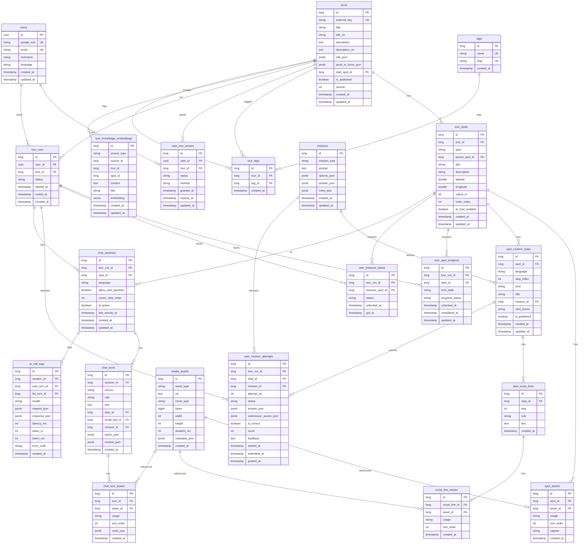

# Quest of Seoul ERD (Entity Relationship Diagram)

## 개요

투어(Tour) 중심 아키텍처의 주요 엔티티와 관계를 설명합니다.

---

## 도메인 구분

1. **인증/사용자:** users, tags
2. **투어 코어:** tours, tour_spots, tour_tags, user_tour_access, tour_runs
3. **스팟 콘텐츠:** spot_content_steps, spot_script_lines, script_line_assets, missions, media_assets, spot_assets
4. **진행 상태:** user_spot_progress, user_treasure_status, user_mission_attempts
5. **채팅/AI:** chat_sessions, chat_turns, chat_turn_assets, ai_call_logs
6. **RAG:** tour_knowledge_embeddings (Pgvector, Spring Boot ↔ ai-server 공유)

---

## ER 다이어그램 (Mermaid)

---

## 테이블 요약

| 테이블 | 설명 |
|--------|------|
| users | 사용자 (OAuth2/JWT 로그인) |
| tags | 태그 |
| tours | 투어 정의 (start_spot_id로 시작 스팟 연결) |
| tour_spots | 스팟 통합 (type: MAIN, SUB, PHOTO, TREASURE) |
| tour_tags | 투어-태그 N:M |
| user_tour_access | 사용자별 투어 접근 (LOCKED → UNLOCKED) |
| tour_runs | 사용자별 투어 실행 (IN_PROGRESS, COMPLETED, ABANDONED) |
| media_assets | 미디어 에셋 (이미지/오디오) |
| spot_assets | 스팟-미디어 매핑 |
| user_spot_progress | Run별 스팟 진행 상태 |
| user_treasure_status | Run별 보물 스팟 상태 |
| missions | 미션 정의 (QUIZ, INPUT, PHOTO_CHECK 등) |
| spot_content_steps | 스팟별 콘텐츠 스텝 (GUIDE, MISSION). next_action: NEXT \| MISSION_CHOICE |
| spot_script_lines | 가이드 스텝의 문장 |
| script_line_assets | 문장-미디어 매핑 |
| user_mission_attempts | Run별 미션 제출 이력 |
| chat_sessions | Run+스팟별 AI 채팅 세션 |
| chat_turns | 채팅 턴 (유저/AI 메시지). **action**(action_json): UI 동작(NEXT/MISSION_START/SKIP). **mission**(mission_id): 게임·미션 정의 참조 |
| chat_turn_assets | 채팅 턴 첨부 미디어 |
| ai_call_logs | AI 호출 로그 |
| tour_knowledge_embeddings | RAG용 투어·가이드 지식 임베딩 (Pgvector, source_type: TOUR/SPOT/GUIDE_LINE) |

### 수집·포토 스팟 (추가 예정)

| 테이블 | 설명 |
|--------|------|
| user_photo_submissions | 포토 스팟 유저 제출 (status: PENDING/APPROVED/REJECTED, mint_token, is_public) |

---

## 주요 Enum

- **SpotType:** MAIN, SUB, PHOTO, TREASURE
- **MarkerType:** STEP, WAYPOINT, PHOTO_SPOT, TREASURE
- **StepKind:** GUIDE, MISSION
- **StepNextAction:** NEXT, MISSION_CHOICE
- **Language:** ko, en, ja
- **TourAccessStatus:** LOCKED, UNLOCKED
- **TourRunStatus:** IN_PROGRESS, COMPLETED, ABANDONED
- **ChatRole:** USER, ASSISTANT
- **ChatSource:** USER, GUIDE, AI
- **MissionAttemptStatus:** STARTED, SUBMITTED, CORRECT, INCORRECT

### chat_turns 용어 정리 (action vs mission)

| 용어 | 필드 | 설명 |
|------|------|------|
| **action** | action_json | UI에서 사용자에게 제공하는 동작. `type`: `NEXT`(다음 컨텐츠), `MISSION_START`(게임 시작), `SKIP`(미션 스킵) |
| **mission** | mission_id | 게임/미션 정의 FK. action이 MISSION_START일 때 연결되는 missions 레코드 |
- **MissionType:** QUIZ, INPUT, PHOTO_CHECK
